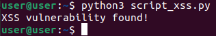

# Práctico 4 : Testing de seguridad

## Pre-requisitos

1. Verificar que la librería `requests` esté instalada. En caso de no estarlo, instalarla ejecutando el siguiente comando:
   ```bash
   pip install requests
   ```

2. Para este práctico utilizamos una imagen de altoro en Docker, para eso es necesario asegurarse de que Docker esté instalado. Si no está instalado, seguir las instrucciones disponibles en [este enlace](https://docs.docker.com/get-docker/).

3. Descargar la imagen de Docker de AltoroJ ejecutando el siguiente comando en la terminal:
   ```bash
   docker run --name altoroj -d -p 8130:8080 jasonhubs/altoroj:3.1.1
   ```

## Pasos para ejecutar el proyecto

### Script 1 : SQL Injection

1. Verificar que el contenedor con la imágen de altoro esté corriendo. Si no se ha iniciado automáticamente, se puede iniciar manualmente con el siguiente comando:
   ```bash
   docker start altoroj
   ```

3. Ejecutar el **script_sql_injection.py** corriendo el siguiente comando:

   ```bash
   python script_sql_injection.py
   ```

### Script 2 : Cross Site Scripting (XSS)

1. Ejecutar el **script_xss.py** corriendo el siguiente comando:

   ```bash
   python script_xss.py
   ```
2. Dado a que el script, a parte de devolver el exit code 1 cuando encuentra una vulnerbilidad, imprime un texto, como se puede ver a continuación, en caso de no encontrar se devuelve el exit code 0 y también se imprime el mensaje correspondiente a la situación.
   



